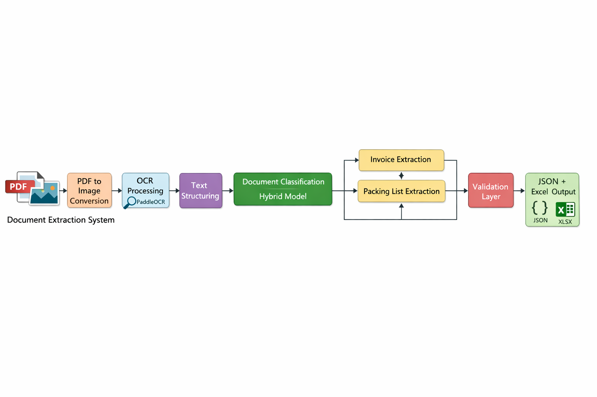
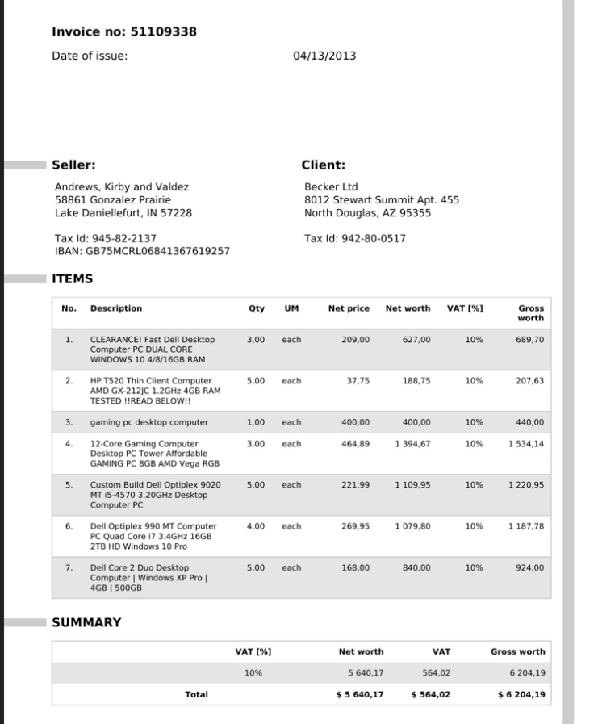
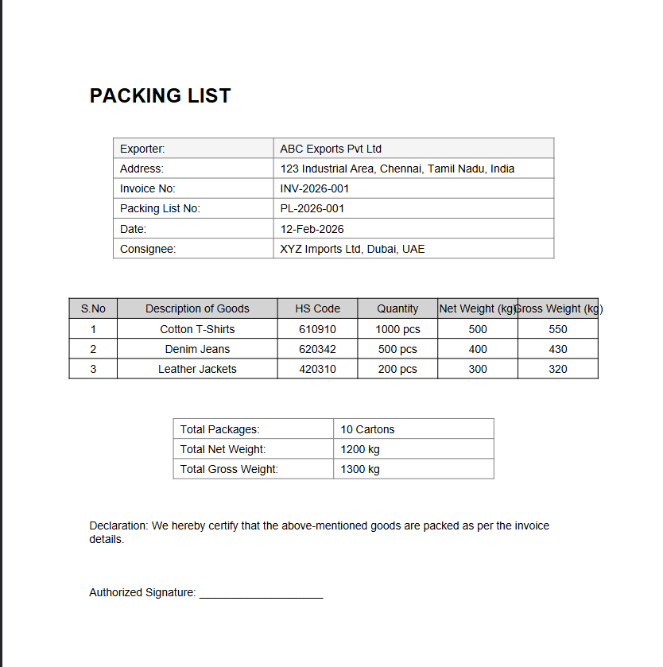

# Design Document  
## Document Extraction Service  

Candidate: Gona Hemanth Durga Rao  
Assessment: API Logistics – Internship Challenge  

---

# 1. Problem Understanding

The objective of this project is to build a local-first document extraction system capable of:

- Classifying a document as either:
  - Invoice
  - Packing List
- Extracting required structured fields
- Generating the output in JSON and Excel format
- Running completely offline without using any external or paid APIs

The system must handle real-world OCR challenges such as vertical tables, multi-line descriptions, and inconsistent formatting while keeping the architecture modular and explainable.

---

# 2. Tech Stack

The following technologies were used:

- Python 3.x  
- PaddleOCR (Local OCR Engine)  
- pdf2image  
- OpenCV  
- Pandas  
- OpenPyXL  

## Why PaddleOCR?

Since external APIs were not allowed, PaddleOCR was selected because:

- It runs completely locally  
- It supports text detection and recognition  
- It works well for structured business documents  
- It preserves text line structure, which is important for table parsing  

## Why Rule-Based Extraction?

Instead of training a model, I chose a deterministic rule-based approach because:

- The document types are structured  
- The required fields are clearly defined  
- The logic remains explainable  
- It avoids unnecessary complexity  
- It ensures predictable and reproducible results  

---

# 3. Component Architecture

## High-Level Flow



System Flow:

Input (PDF / Image)  
→ PDF to Image Conversion  
→ OCR using PaddleOCR  
→ Line-Based Text Structuring  
→ Hybrid Classification  
→ Invoice Extractor / Packing Extractor  
→ Validation  
→ JSON + Excel Output  

---

# 4. Module-Level Design

## 4.1 main.py

Acts as the entry point of the application.

Responsibilities:

- Accept input file path  
- Call OCR module  
- Call classification module  
- Route to the appropriate extractor  
- Trigger validation  
- Generate JSON and Excel output  

This file ensures clean orchestration between modules.

---

## 4.2 OCR Layer (ocr.py)

Responsibilities:

- Convert PDF to images (if required)  
- Apply PaddleOCR  
- Preserve text line-by-line  
- Save raw OCR output for debugging  

Important Design Decision:

Initially, flattening the OCR text into a single string caused major extraction errors.

Therefore, the line-based structure was preserved so that:

- Item numbers could be detected correctly  
- Multi-line descriptions could be handled  
- Vertical table formats could be parsed reliably  

This significantly improved system reliability.

---

## 4.3 Classification Layer (classifier.py)

A hybrid classification approach was implemented.

Step 1 – Heading Detection

If strong identifiers such as:
- INVOICE  
- PACKING LIST  

are found, classification is immediate.

Step 2 – Keyword Scoring

If heading is unclear:
- Invoice-related keywords are scored  
- Packing-related keywords are scored  
- The higher score determines the document type  

The system outputs:
- Document type  
- Confidence score  

This balances simplicity and robustness.

---

## 4.4 Invoice Extraction Logic

Challenges Faced:

- Multi-line item descriptions  
- Vertical OCR layout  
- Currency values split across lines  
- Inconsistent alignment  

Final Strategy:

Block-based parsing:

1. Detect item number positions  
2. Extract content between item numbers  
3. Dynamically assign:
   - Description  
   - Quantity  
   - Unit  
   - Net Price  
   - Gross Price  

Instead of relying on fixed index positions, extraction is pattern-driven.  
This improves tolerance to layout variations.

---

## 4.5 Packing List Extraction Logic

Challenges Faced:

- Vertical column layout  
- Net and Gross weight appearing before item number  
- OCR header noise  
- Misaligned numeric values  

Final Strategy:

Dynamic block detection:

1. Identify item number indices  
2. Extract text between consecutive item numbers  
3. Detect fields using patterns:
   - HS Code → 6-digit numeric  
   - Quantity → contains “pcs”  
   - Weight → numeric-only lines  

This allows the system to handle irregular layouts without breaking.

---

## 4.6 Validation Layer

Validation ensures:

- Required fields are present  
- Line items are not empty  
- Classification confidence is displayed  
- Errors are handled gracefully  

The system avoids abrupt termination and instead provides meaningful error messages.

---

## 4.7 Output Layer

The system generates:

- JSON file  
- Excel (.xlsx) file  

Excel Structure:

- Sheet 1 → Metadata  
- Sheet 2 → Line_Items  

Separating metadata and line items improves readability and usability.

---

# 5. Exception Handling

The system handles:

- Missing input files  
- PDF conversion errors  
- OCR misalignment  
- Missing required fields  
- Classification conflicts  

Raw OCR output is stored in:

output/raw_text.txt

This helps in debugging layout-related extraction issues.

---

# 6. Sample Inputs

## Invoice Input


## Packing List Input


---

# 7. Sample Outputs

## Invoice JSON Output

```json
{
  "vendor_name": "Andrews,Kirby and Valdez",
  "invoice_number": "51109338",
  "invoice_date": "04/13/2013",
  "line_items": [
    {
      "item_no": "1",
      "description": "CLEARANCE! Fast Dell Desktop",
      "quantity": "3,00",
      "unit": "each",
      "net_price": "209,00",
      "gross_price": "689,70"
    }
  ],
  "document_type": "invoice",
  "classification_confidence": 100
}
```

## Excel Output

The Excel file contains:

- Metadata Sheet  
- Line_Items Sheet  

---

# 8. Design Principles Followed

- Modular Architecture  
- Single Responsibility Principle  
- Deterministic Parsing Logic  
- Layout-Aware Extraction  
- Local-First Processing  
- Explainable Implementation  

The goal was to build a solution that is maintainable, understandable, and robust rather than unnecessarily complex.

---

# 9. Known Limitations

- Assumes semi-structured invoice and packing list templates  
- Completely different layouts require additional rule extensions  
- OCR accuracy directly impacts extraction accuracy  
- Not ML-based layout detection  
- Extremely noisy or blurred documents may reduce performance  

---

# 10. Future Improvements

- Layout-aware column detection  
- Template configuration engine  
- Field-level confidence scoring  
- Support for additional document types  
- ML-based structure detection for complex layouts  

---

# 11. Conclusion

This project demonstrates a fully local document extraction system that:

- Performs hybrid document classification  
- Uses block-based intelligent parsing  
- Handles vertical and irregular table layouts  
- Generates structured JSON and Excel outputs  
- Adheres strictly to the local-first constraint  

The system prioritizes clarity, modularity, deterministic logic, and explainability while maintaining robustness against common OCR and layout challenges.